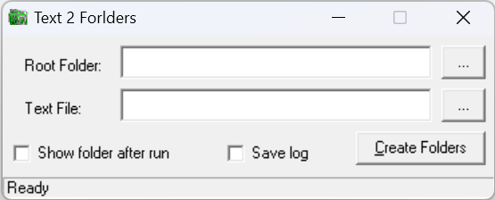

## Introduction
This is a simple tool created by Visual Basic 6.0 which can create multi folders with a list file.

## Notice
As the development platform Visual Basic 6.0 is really old, the new windows operating system may lack VB6 runtime and VB6 common controls, that means user who wants to run this software on new system need find the runtime and controls manually.

## Usage
Download Text2Folders.exe in releaese, run it

Each line of <kbd>Text File</kbd> contail a folder name, muti-level directory not support.
